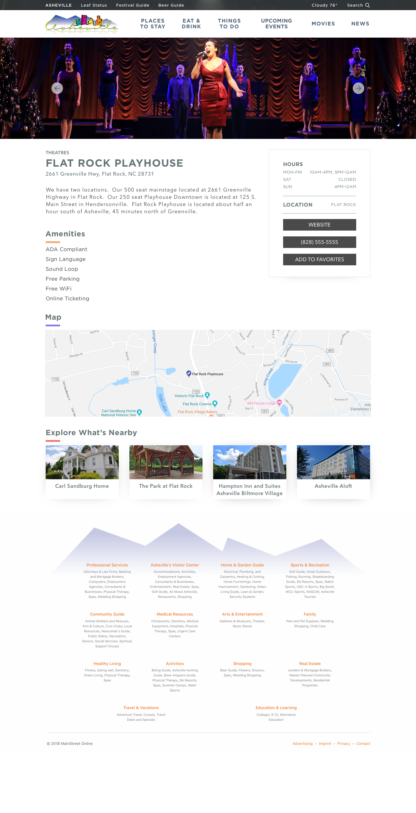

<Screenshot
  backgroundImage={props.screenshotBackground}
  offsetColor={props.style && props.style.screenshot_offset}
  shadowColor={props.style && props.style.screenshot_shadow}
>

</Screenshot>

Asheville.com has served as a valuable resource for millions of users for more than two
decades. It provides information on news, events, lodging, attractions, and more.

<Screenshot
  backgroundImage={props.screenshotBackground}
  offsetColor={props.style && props.style.screenshot_offset}
  shadowColor={props.style && props.style.screenshot_shadow}
>

</Screenshot>
