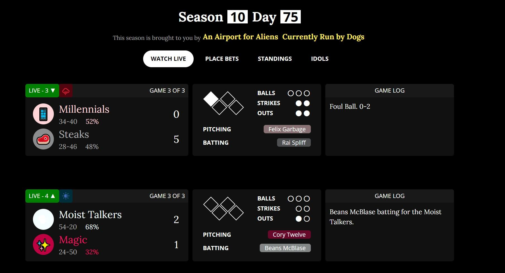
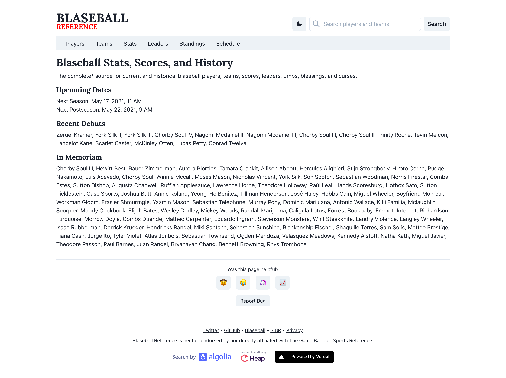
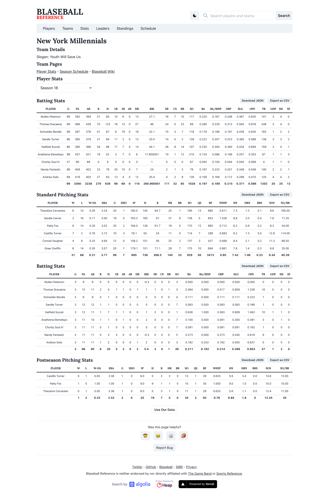
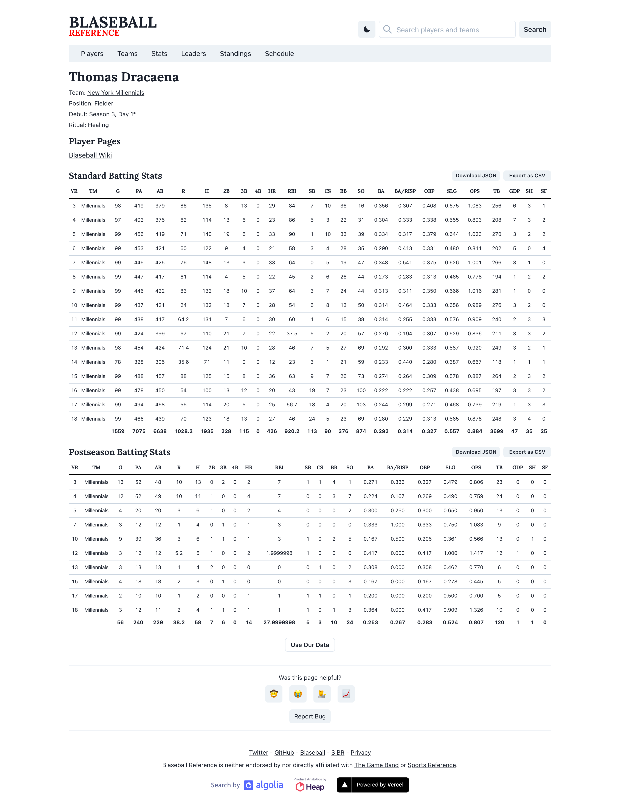
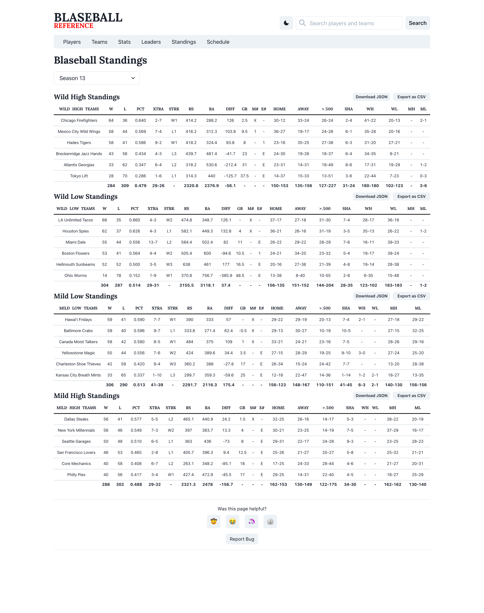
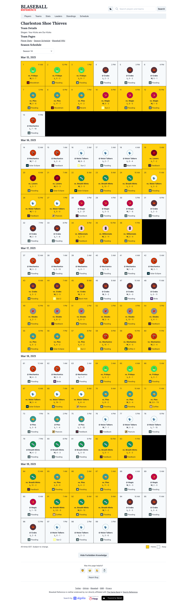

Inspired by its real-world counterpart of a similar name, [Blaseball Reference](https://blaseball-reference.com/) is a website that
displays tabulated performance statistics for the game of [Blaseball](http://blaseball.com). The game
is an absurdist take on fantasy baseball which revolves around a simulator with made-up teams that
play against each other twenty-four hours a day.

Players of the browser-based game form communities to support their favorite teams, participating in the
action by placing bets on the winners. And resembling aspects of Nomic, the 1982 game crafted by
philosopher Peter Suber, players are allowed to shape the game's rules. From unwrapping the mysteries
of a hidden rulebook to resurrecting dead players, weekly elections allow players to participate in
the development of the game.

As written in the [_LA Times_](https://www.latimes.com/entertainment-arts/story/2020-08-24/blaseball-online-browser-game-dungeons-dragons),
"'Blaseball' strips baseball of its emphasis on competition and reminds us of why we love the game to begin with: It’s
the personal stories sports inspire us to have with our friends or loved ones."

<Screenshot
  backgroundImage={props.screenshotBackground}
  offsetColor={props.style && props.style.screenshot_offset}
  shadowColor={props.style && props.style.screenshot_shadow}
>

</Screenshot>

In the early weeks of the game's launch, players soon realized that the simulator's output, that is
the play-by-play log of events for each game, would be lost to time as there was no archival process.
A small group of fans quickly put together a solution: a script that collected every server-side
event broadcasted from the game's simulator.

With that wealth of data, there was a rush to make use of it. Blaseball Reference was then created
to process the in-game events and summarize the relevant data in the context of sabermetrics. The
goal of the website was to allow users to quickly see which teams were on hot streaks, which
players were league leaders, and investigate how the weekly user elections affected the overall
performance of teams and players.

<Screenshot
  backgroundImage={props.screenshotBackground}
  offsetColor={props.style && props.style.screenshot_offset}
  shadowColor={props.style && props.style.screenshot_shadow}
>

</Screenshot>

React was chosen for the front-end alongside [Chakra UI](http://chakra-ui.com) for the modular component
library. For the backend, a Node.js worker was initially used to process individual game events and
tabulate the results into JSON buckets for each team and player.

<Screenshot
  backgroundImage={props.screenshotBackground}
  offsetColor={props.style && props.style.screenshot_offset}
  shadowColor={props.style && props.style.screenshot_shadow}
>

</Screenshot>

After the initial backend was put into place, work began on migrating the processed data to a
querably system in order to support multiple client use cases. Once again taking inspiration from
the real world, [Retrosheet event files](https://www.retrosheet.org/eventfile.htm) were analyzed to
help craft the structure of the Postgres database and the in-game state representation of Blaseball.

<Screenshot
  backgroundImage={props.screenshotBackground}
  offsetColor={props.style && props.style.screenshot_offset}
  shadowColor={props.style && props.style.screenshot_shadow}
>

</Screenshot>

A Node.js API was constructed using a mixture of direct queries as well as
[Prisma ORM](https://www.prisma.io), loosely basing its design on the official MLB Stats API. The
central goal of the design was to allow clients to query stats based on season, splits, and game
type. Query performance was incrementally improved by analyzing query plans, materializing views,
and adding a cache layer in front of the database.

<Screenshot
  backgroundImage={props.screenshotBackground}
  offsetColor={props.style && props.style.screenshot_offset}
  shadowColor={props.style && props.style.screenshot_shadow}
>

</Screenshot>

With in-game performance statistics in place, work shifted to filling other user needs. An often
requested feature was the ability to view "season" schedules to see upcoming games. Future game
data was broadcasted through the game API at the start of each season, which allowed for the
creation of a traditional season schedule calendar. Data was updated after every game to constantly
keep the schedule up-to-date.

<Screenshot
  backgroundImage={props.screenshotBackground}
  offsetColor={props.style && props.style.screenshot_offset}
  shadowColor={props.style && props.style.screenshot_shadow}
>

</Screenshot>
