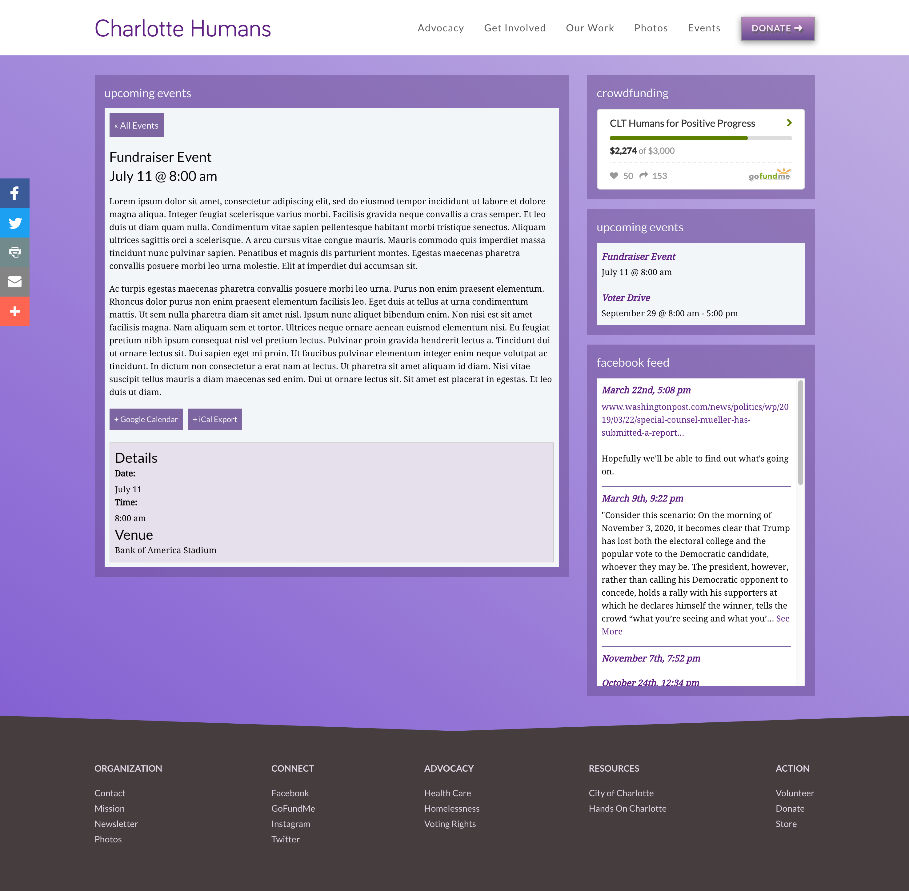

<Screenshot offsetColor={props.style && props.style.screenshot_offset} shadowColor={props.style && props.style.screenshot_shadow}>

</Screenshot>

Charlotte Humans began in 2017 as a progressive advocacy group in the Southeast. The organization sought to create an online presence with a focus on efficiently mobilizing supporters into direct action.

<Screenshot offsetColor={props.style && props.style.screenshot_offset} shadowColor={props.style && props.style.screenshot_shadow}>

</Screenshot>
