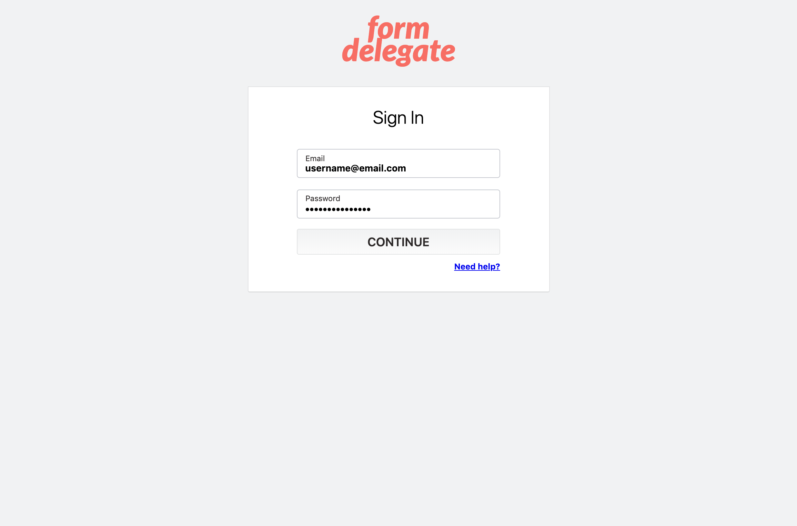

Form Delegate is a form processing service built with a focus on privacy and security. It
allows users to encrypt messages with a public key via Keybase's KBPGP library, while also
providing convenient integrations with services such as SendGrid and Ifttt.

<Screenshot
  backgroundImage={props.screenshotBackground}
  offsetColor={props.style && props.style.screenshot_offset}
  shadowColor={props.style && props.style.screenshot_shadow}
>

</Screenshot>

It is in active development and is expected to launch in late 2019. It uses Elixir
to power the backend and is currently capable of processing more than 25,000 messages
per minute with just a 200 MB memory instance.

<Screenshot
  backgroundImage={props.screenshotBackground}
  offsetColor={props.style && props.style.screenshot_offset}
  shadowColor={props.style && props.style.screenshot_shadow}
>

</Screenshot>

The frontend is written in TypeScript and JavaScript using React.

<Screenshot
  backgroundImage={props.screenshotBackground}
  offsetColor={props.style && props.style.screenshot_offset}
  shadowColor={props.style && props.style.screenshot_shadow}
>

</Screenshot>
