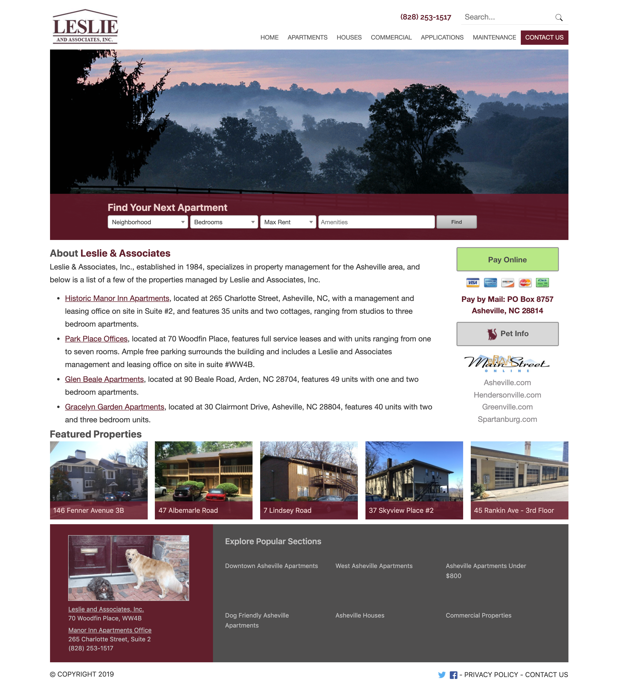
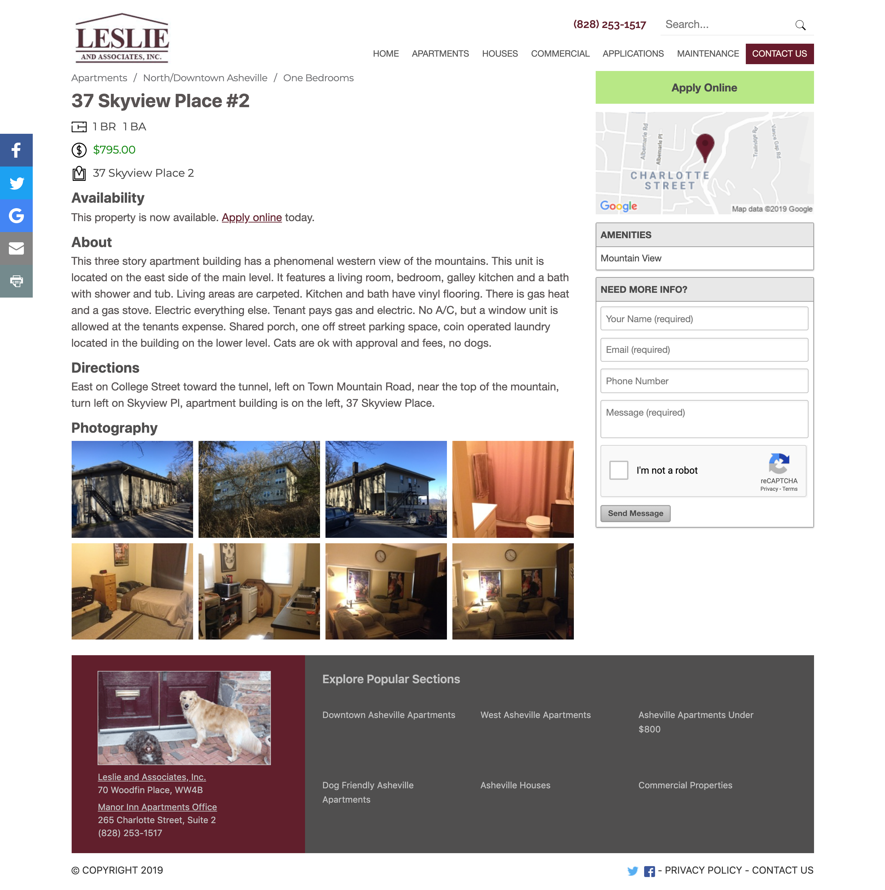
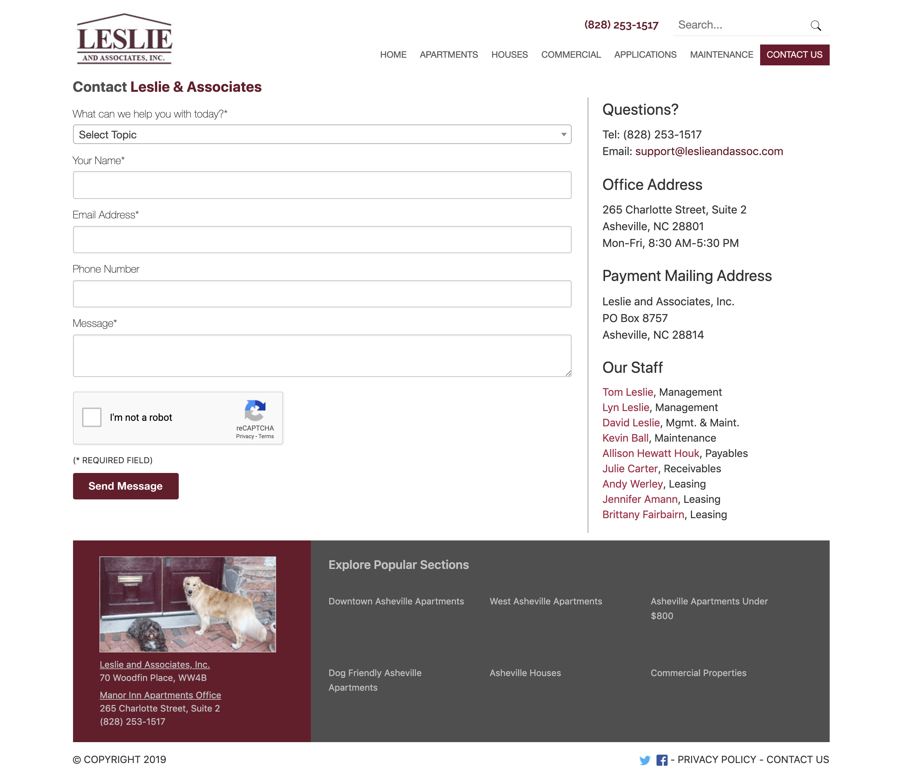

<Screenshot
  backgroundImage={props.screenshotBackground}
  offsetColor={props.style && props.style.screenshot_offset}
  shadowColor={props.style && props.style.screenshot_shadow}
>

</Screenshot>

<Screenshot
  backgroundImage={props.screenshotBackground}
  offsetColor={props.style && props.style.screenshot_offset}
  shadowColor={props.style && props.style.screenshot_shadow}
>

</Screenshot>

<Screenshot
  backgroundImage={props.screenshotBackground}
  offsetColor={props.style && props.style.screenshot_offset}
  shadowColor={props.style && props.style.screenshot_shadow}
>

</Screenshot>

<Screenshot
  backgroundImage={props.screenshotBackground}
  offsetColor={props.style && props.style.screenshot_offset}
  shadowColor={props.style && props.style.screenshot_shadow}
>

</Screenshot>
