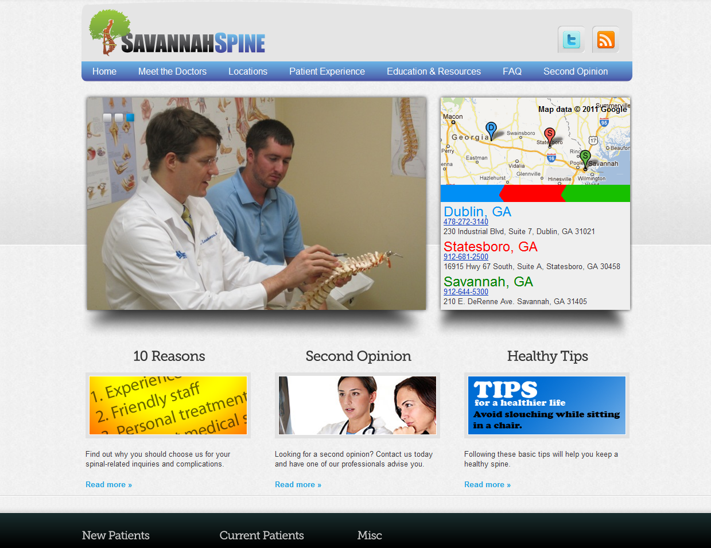
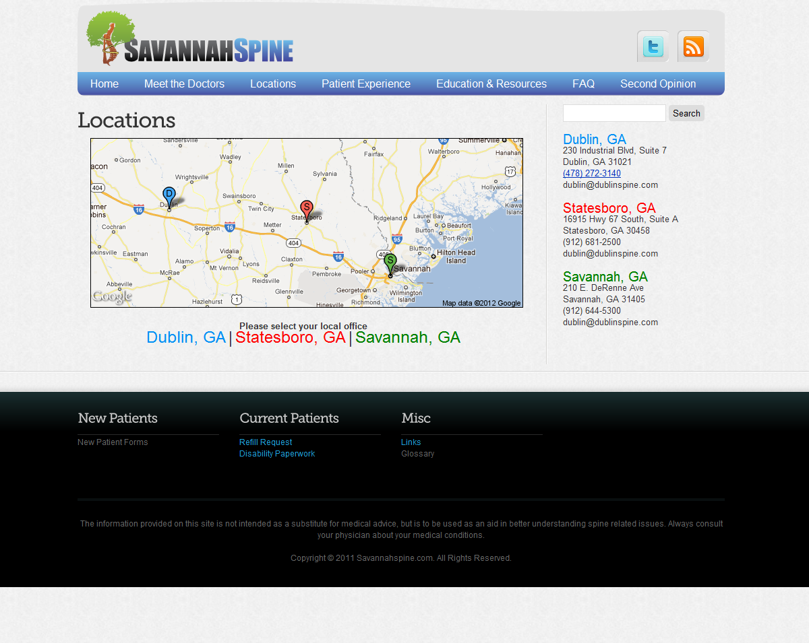
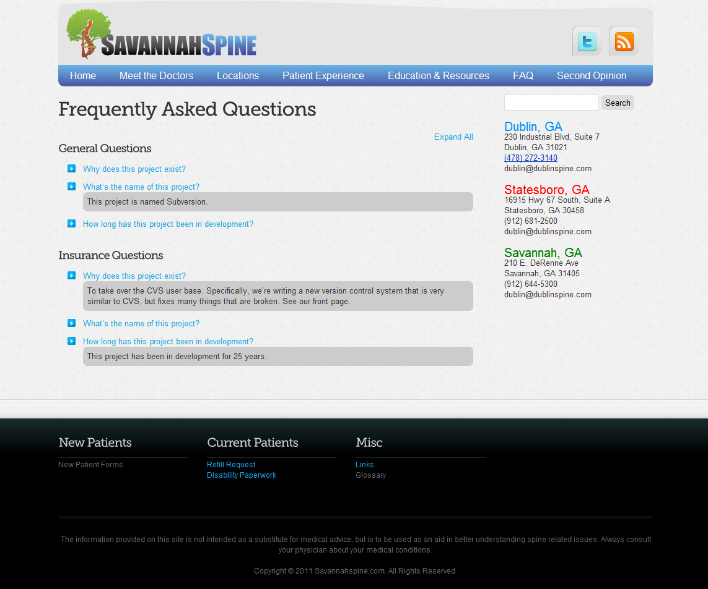

Savannah Spine was a medical group practice spanning several cities across
Georgia. The group was undergoing a rapid expansion and needed a brand identity
and web presence launched within weeks of an initial consultation.

Working closely with various stakeholders and iterating quickly led to a
successful launch and enabled Savannah Spine to proceed to their additional expansion
goals.

<Screenshot
  backgroundImage={props.screenshotBackground}
  offsetColor={props.style && props.style.screenshot_offset}
  shadowColor={props.style && props.style.screenshot_shadow}
>

</Screenshot>

<Screenshot
  backgroundImage={props.screenshotBackground}
  offsetColor={props.style && props.style.screenshot_offset}
  shadowColor={props.style && props.style.screenshot_shadow}
>

</Screenshot>

<Screenshot
  backgroundImage={props.screenshotBackground}
  offsetColor={props.style && props.style.screenshot_offset}
  shadowColor={props.style && props.style.screenshot_shadow}
>

</Screenshot>
