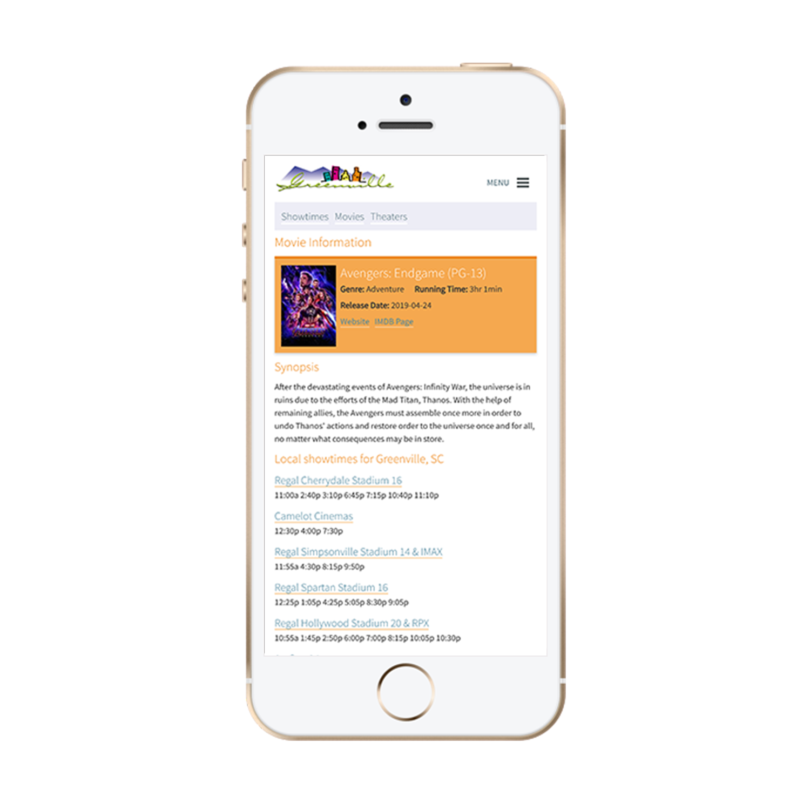

Now Showing is a product that serves hundreds of thousands of users each month,
providing movie showtimes as well as information on local theaters. It is provided
as a white label product to tourism, entertainment, and municaplity organizations
across the United States.

<Screenshot
  backgroundImage={props.screenshotBackground}
  offsetColor={props.style && props.style.screenshot_offset}
  shadowColor={props.style && props.style.screenshot_shadow}
>

</Screenshot>

<Screenshot
  backgroundImage={props.screenshotBackground}
  offsetColor={props.style && props.style.screenshot_offset}
  shadowColor={props.style && props.style.screenshot_shadow}
>

</Screenshot>
