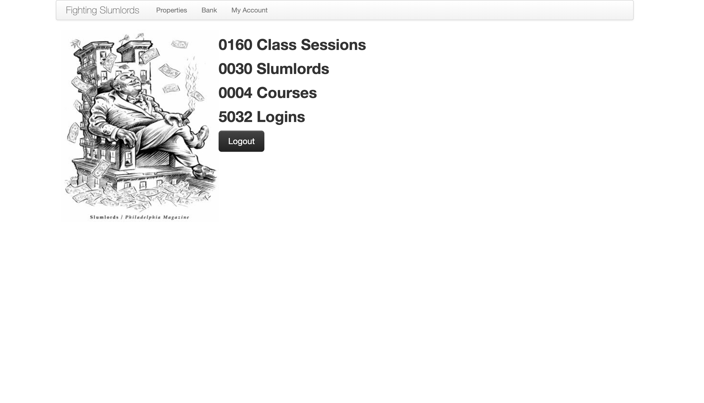
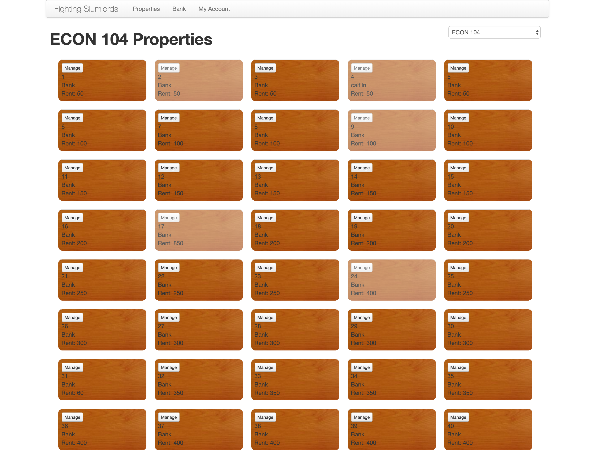
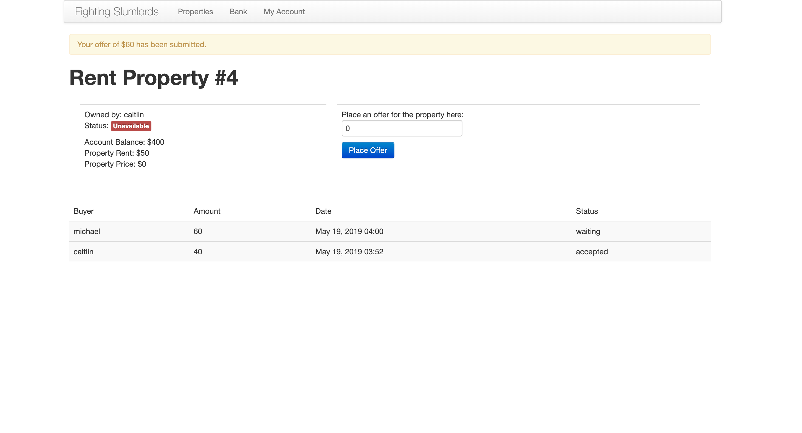

Slumlords is a supplemental educational application for classrooms learning introductory
economics. With the classroom desks serving as real estate assets and the students
as tenants and owners, the underlying educational material is brought to life with
fun mechanics and sometimes difficult lessons.

<Screenshot
  backgroundImage={props.screenshotBackground}
  offsetColor={props.style && props.style.screenshot_offset}
  shadowColor={props.style && props.style.screenshot_shadow}
>

</Screenshot>

At the beginning of a course, the desks in a classroom are represented as a set
of rows and columns. Every student is provided a weekly wage that accumulates with each class
session unless they record an absence or tardiness. As a rule, a student can only
sit at a desk that they own or are renting. If a student cannot afford a desk
during a given week, the teacher may assign a less desirable seating situation.

<Screenshot
  backgroundImage={props.screenshotBackground}
  offsetColor={props.style && props.style.screenshot_offset}
  shadowColor={props.style && props.style.screenshot_shadow}
>

</Screenshot>

The students begin playing the game by renting a seat from the bank. However,
the rents are varied by their desirability; For example, a desk near an
air conditioning unit could be highly valued, while the desk near a trashcan
could be less valued.

Once a desk is purchased by a student from the bank, that student no longer pays its rent. They
control its future sale price, and they may either sit there, rent it out
to another person for a fee of their choosing, or leave it vacant. There is no limit
to the number of desks a student can own.

<Screenshot
  backgroundImage={props.screenshotBackground}
  offsetColor={props.style && props.style.screenshot_offset}
  shadowColor={props.style && props.style.screenshot_shadow}
>

</Screenshot>
