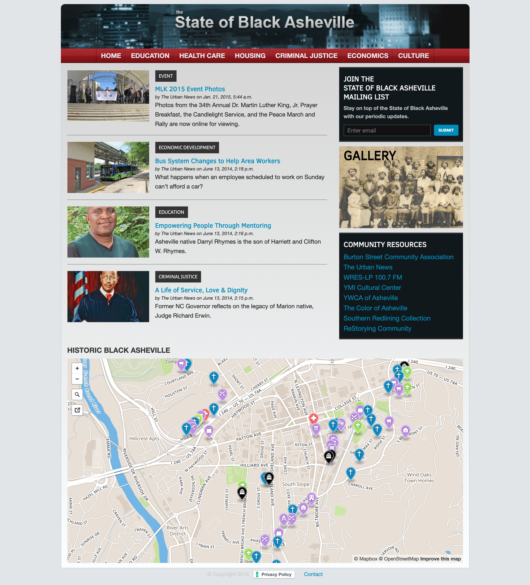
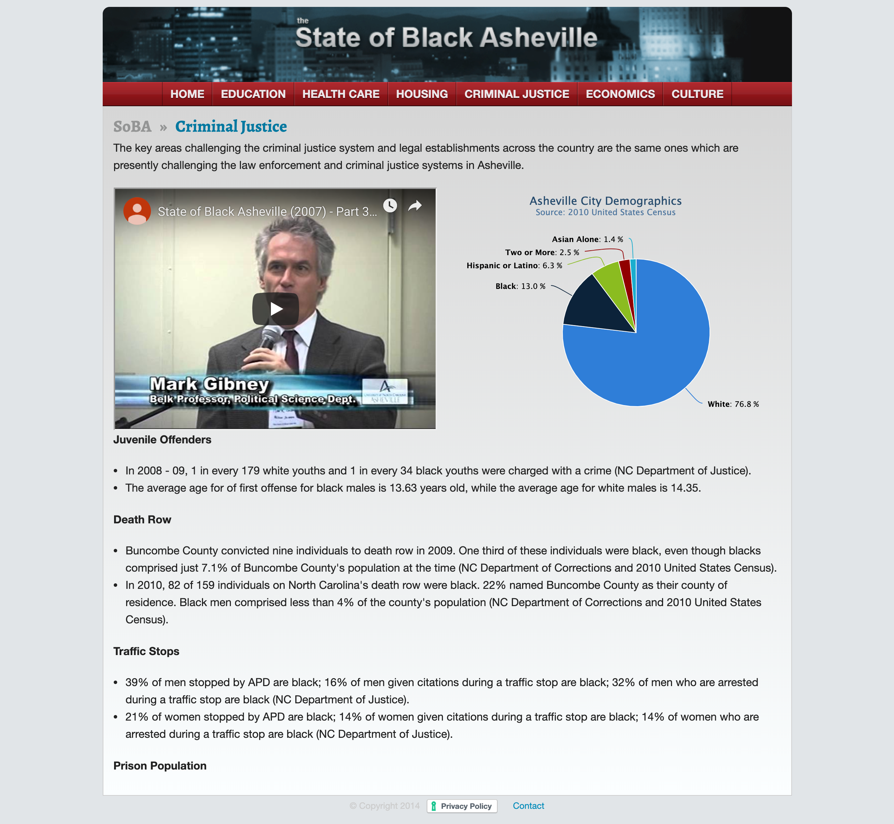

The State of Black Asheville is the creation of Dr. Dwight Mullen, a professor
of political science and Africana studies at the University of North Carolina at
Asheville. The project began in 2006 as a response to the question: What would
happen if an event similar to Hurricane Katrina hit Asheville?

<Screenshot
  backgroundImage={props.screenshotBackground}
  offsetColor={props.style && props.style.screenshot_offset}
  shadowColor={props.style && props.style.screenshot_shadow}
>

</Screenshot>

The research group started as a disparate-impact analysis targetting the hard
numbers in policy areas from housing to criminal justice to education. Year
after year, each group surfaced data which showed significant disparities by race
and gender.

The findings led to the student-led research groups presenting an annual
conference for the community, titled The State of Black Asheille. Each year
students provided their findings to the public, city officials, and
various other stakeholders.

<Screenshot
  backgroundImage={props.screenshotBackground}
  offsetColor={props.style && props.style.screenshot_offset}
  shadowColor={props.style && props.style.screenshot_shadow}
>

</Screenshot>

In 2013, an initial web presence was launched at StateOfBlackAsheville.org,
providing access to student papers, photography, as well as videos from years
prior. The organization is now continuing its mission at an updated website,
found at <Link href="https://stateofblackasheville.com/" openInNewWindow="true">www.StateOfBlackAsheville.com</Link>.
